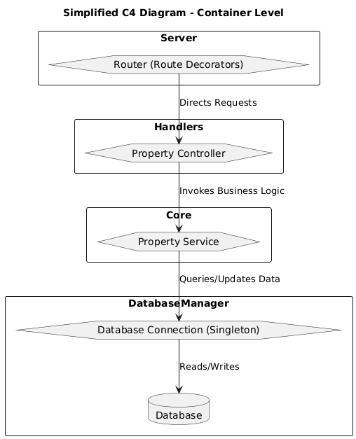

# HABI Microservice 

## Descripción del Proyecto

Este proyecto tiene varios requerimientos funcionales y no funcionales, destacando su desarrollo sin el uso de ORM ni frameworks como Django, FastAPI, Flask, entre otros, en su lugar se crean sus propios modulos simulando un nuevo framework y ORM. A continuación, se describen las actividades realizadas para cumplir con los requisitos establecidos y las tecnologías utilizadas.

## 1. Análisis de la Solución y Selección de Tecnologías

El enfoque del proyecto es crear una solución escalable y robusta, sin depender de un ORM o de frameworks conocidos; para esto, se realiza la creación de nuevos modulos permitiendo el control y personalización para la adaptación de su uso dentro de nuestro desarrollo. Se propone una arquitectura modular y flexible que permita la evolución del sistema a lo largo del tiempo.

A continuacion se describe a traves del diagrama C4 el sistema de software que se implementó

**Diagrama C4:**  

### 1.1 Selección del Stack Tecnológico

- **Python 3.11:** Lenguaje de programación principal del proyecto.
- **Poetry:** Herramienta para la gestión de dependencias y del proyecto.
- **Gitflow:** Estrategia de gestión de ramas para el control de versiones y desarrollo colaborativo.

## 2. Planificación de Actividades

Para cumplir con los requisitos de diseño, se planteó una ruta de desarrollo que divide el proyecto en módulos así:

1. **Creación del servidor:** El primer módulo se centró en la configuración del servidor y su entorno.
2. **Administración de base de datos:** El segundo módulo se encargó de gestionar la conexión a la base de datos y la definición de los modelos de datos.
3. **Gestión de servicios y rutas:** La etapa final implementó la lógica para la gestión y exposición de las rutas necesarias del microservicio.

Cada una de estas fases fue desglosada en actividades más pequeñas y organizadas en un tablero Kanban, lo que permitió adoptar metodologías ágiles como Scrum.

Para acceder al tablero por favor dar click en el siguente link [Tablero Kanban](https://github.com/users/JohanBustos/projects/4/views/1)

## 3. Desarrollo

### 3.1. Abstracción del Cliente HTTP

Se desarrolló una abstracción de cliente HTTP que permite extender funcionalidades para gestionar y administrar las rutas a escuchar en el microservicio. Este cliente incluye una clase para inicializar el servidor y un decorador para crear y gestionar las rutas necesarias.

### 3.2. Abstracción para la Conexión a la Base de Datos

Para la gestión de la base de datos, se implementó un cliente que se conecta a una base de datos MySQL utilizando una librería especializada. Este cliente fue diseñado con la capacidad de crear objetos de tipo singleton para optimizar las conexiones a la base de datos.

### 3.3. Creación de un ORM Privado

Se desarrolló una abstracción para un ORM privado, lo que permite extender funcionalidades como el método de búsqueda sobre los modelos de datos. Esta solución se alinea con las buenas prácticas de *clean code* y facilita la implementación de futuras mejoras en el proyecto.

### 3.4. Exposición de la Ruta con Lógica de Negocio

Una vez completados los módulos anteriores, el siguiente paso fue exponer la ruta con la lógica de negocio, que cumple con el primer requisito funcional de la prueba.

## Conclusión

Con estos pasos, el proyecto establece una base sólida para el desarrollo de servicios escalables y de fácil mantenimiento. La arquitectura modular, junto con el uso de técnicas de *clean code*, garantiza la flexibilidad y calidad a largo plazo.

## Autor

**Johan Bustos**

- **Correo:** [johan.bustosm@gmail.com](mailto:johan.bustosm@gmail.com)
- **LinkedIn:** [linkedin.com/in/johan-bustos-a6a03513a](https://www.linkedin.com/in/johan-bustos-a6a03513a/)
